# COMP30880 Call for Cthulhu

|                                 Simulated Annealing                                  |                                Genetic Algorithm                                 |
| :----------------------------------------------------------------------------------: | :------------------------------------------------------------------------------: |
| 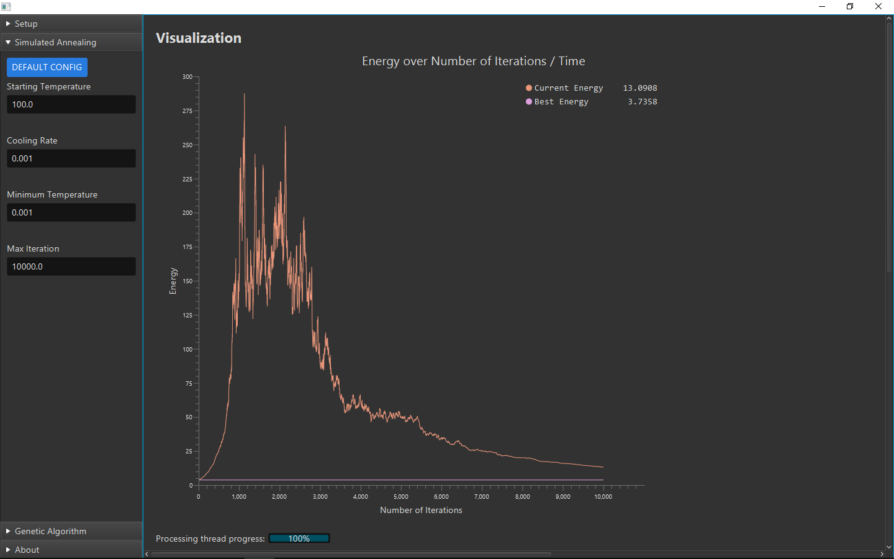 | 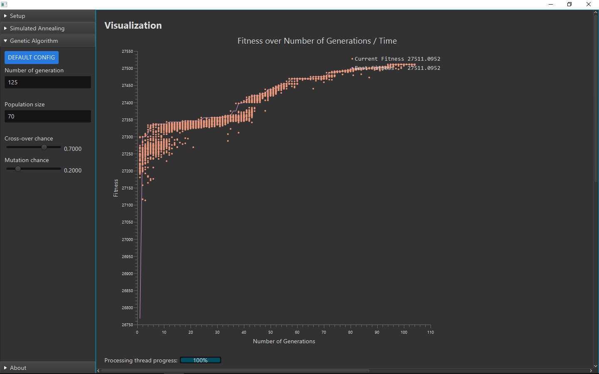 |

## About
Call-for-Cthulu is a software engineering project that aims to create a software application that employs machine learning algorithms (mainly Simulated Annealing and Genetic Algorithm) to assign final year projects to college students based on the students' preference list and GPA, as well as certain hard constraints and soft constraints as listed in Setup's Settings page.

Despite the name, it is not related to the survival horror game or the book written by Lovecraft.

&nbsp;

## Running the application
1. Open a terminal and navigate to the file where run.sh is.
2. Run run&#46;sh (i.e. `./run.sh`) (It uses maven to build the JAR, then Java to run the JAR))

&nbsp;

## Authors

- [bryansng](https://github.com/bryansng)
- [ankishraj](https://github.com/ankishraj)
- [RSM61123](https://github.com/RSM61123)

&nbsp;

## Acknowledgments

- [Tony Veale](https://people.ucd.ie/tony.veale)

&nbsp;

## Pages

### Setup

#### Settings tab

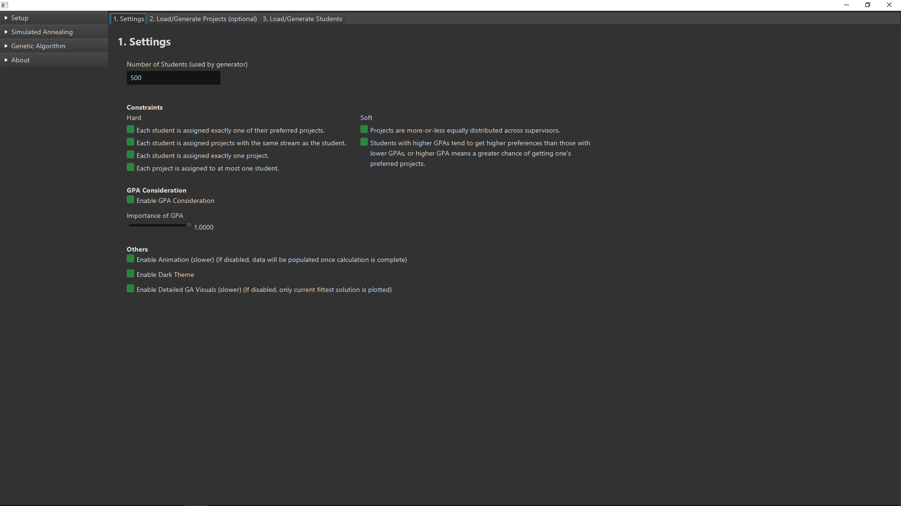

#### Load/Generate Projects tab

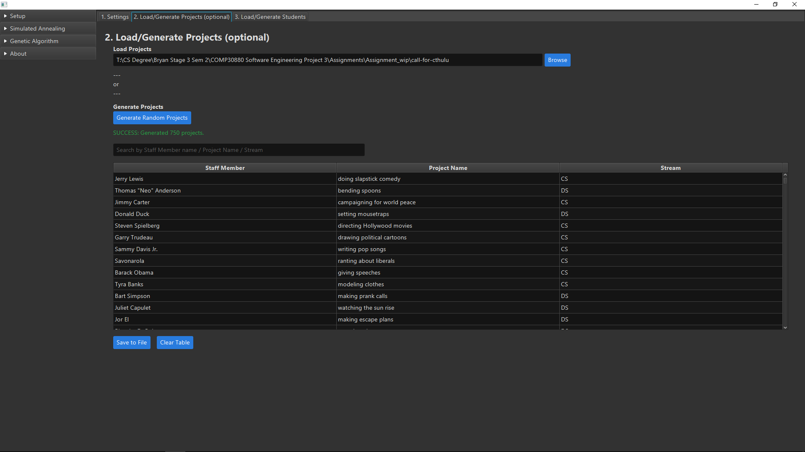

#### Load/Generate Students tab

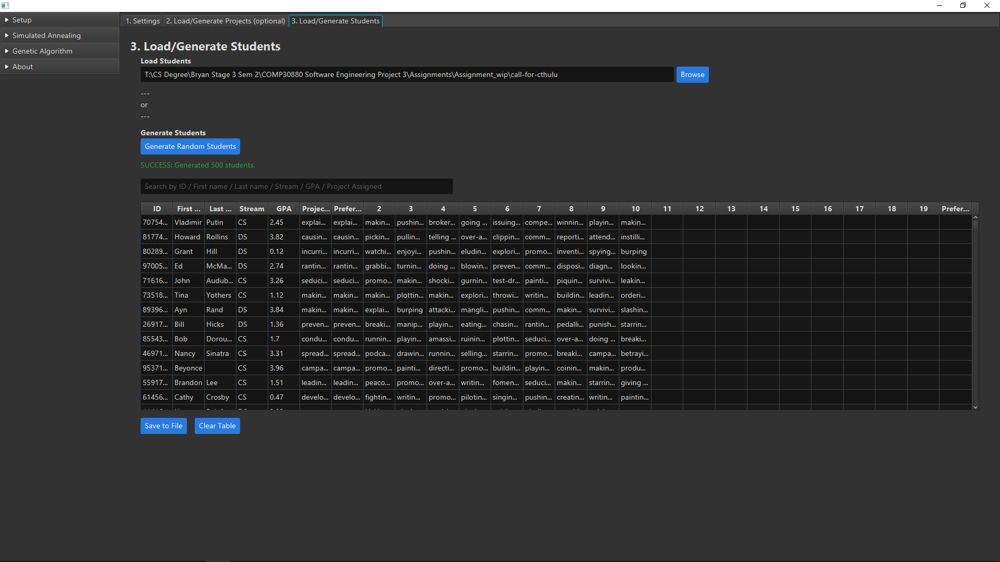

&nbsp;

### Simulated Annealing

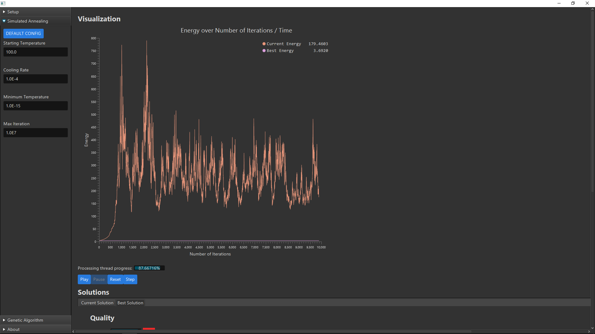

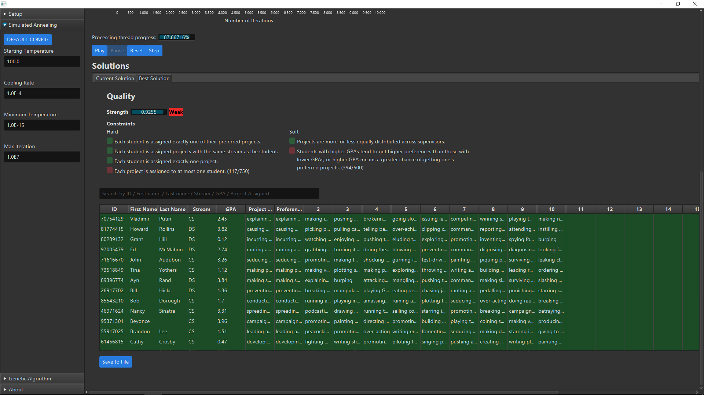

&nbsp;

### Genetic Algorithm

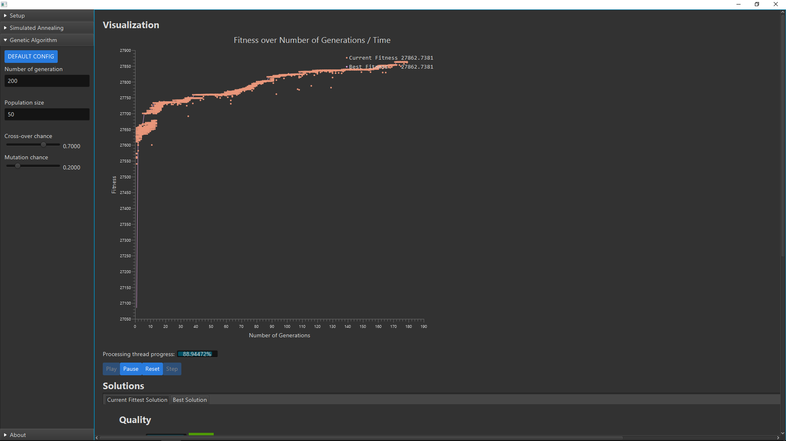
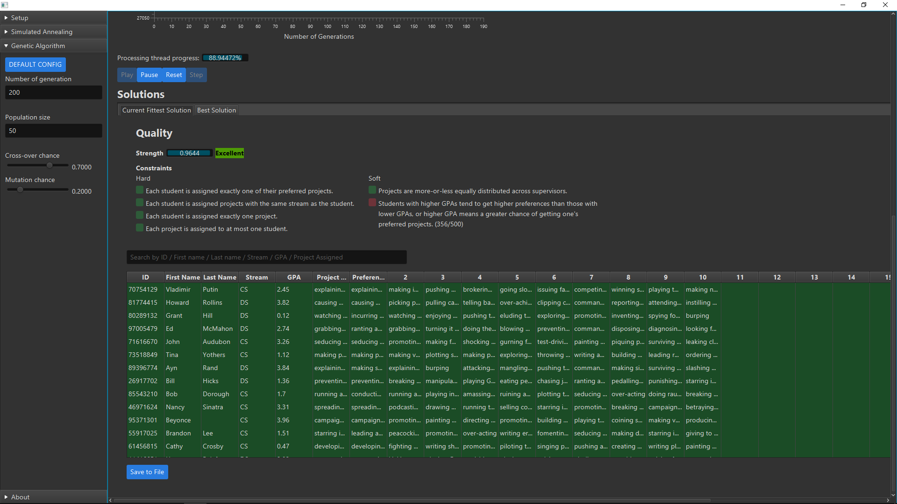

&nbsp;

### About

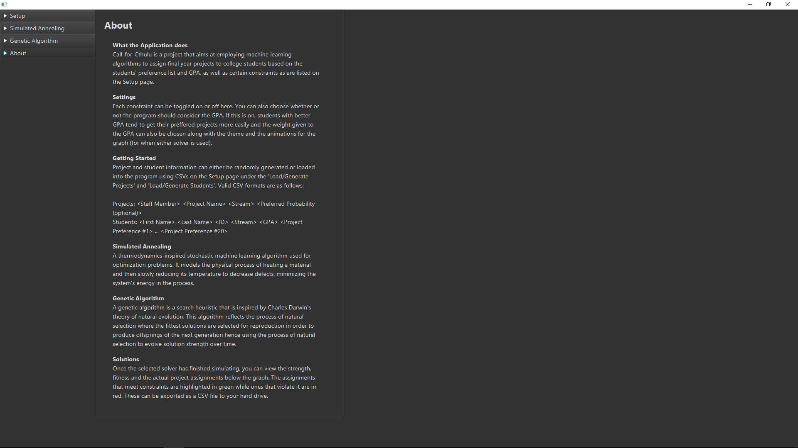

&nbsp;

<!-- ## How demands are met
- Generate a spreadsheet of projects and supervisors, stating the target audience of each project.
  - Spreadsheet is generated in the form of Excel files (with .xlsx extensions). They are named `StaffProject<numberOfStudents>.xlsx`. Each row is in the form of \<Staff Name\> \<Research Activity\> \<Stream\>.
  - \<Staff Name\> and \<Research Activity\> values are taken directly from `MiskatonicStaffMembers.xlsx`. Difference between ours and the given excel file is:
    - (1) There can exist the same Staff Name, but with different Research Activity. (i.e. "Staff members may propose multiple projects on multiple topics.")
    - (2) In `MiskatonicStaffMembers.xlsx`, each Staff has multiple Research Activities separated by `", "`. `StaffProject<numberOfStudents>.xlsx` has only one specific Research Activity per row.
    - (3) Stream of studies are made explicit. If cell was empty, 50:50 chance it will be `CS` or `CS+DS`, if Dagon Studies, it will be `DS`. (i.e. "DS members propose DS only projects. Non-DS members propose CS or CS+DS projects, but not DS-only projects.")
- Invent some students.
  - The spreadsheet is also generated in Excel files. Named `StudentPreference<numberOfStudents>.xlsx`. Each row is in the form of \<First Name\> \<Last Name\> \<ID\> \<Stream\> \<Preference 1\> \<Preference 2\> ... \<Preference 10\>.
  - Student names are taken from `initials.txt`. It is a dataset of famous celebrities. Their first names and last names are parsed accordingly. (i.e. "You can name your test students in a variety of ways").
  - Student ID is always 8-digits (more than enough). Randomly assigned between the range of 1000 0000 to 9999 9999. It is taken cared of that no two students will have the same ID.
  - Stream assignment based on random number between 1 to 5. If 1-3 is CS (3/5), if 4-5 is DS (2/5). (i.e. "Assume breakdown between CS and DS students is 60/40").
  - Since number of projects proposed always greater than the number of students, we assume each student will always get a different first preference (this is done by checking if the randomly selected project has been assigned as 1st preference to someone else). (i.e. Give each student his/her highest-ranked preference while ensuring no student gets the same project as someone else).
  - All named `StaffProject<numberOfStudents>.xlsx` respectively. (i.e. Generate test set with 60, 120, 240 and 500 students).
  - Match Project and Student if the streams match, i.e. P is CS == S is CS, P is DS == S is DS, and P is CS+DS == S is CS, where P stands for Project and S for student. (i.e. Students express preference for projects suited to their stream).
  - This is proven in `Analysis500 (ForDocumentation).xlsx`, which includes graphs to show you it works. Each project is assigned a preference probability (this probability is determined via Random.nextGaussian() (mean 0, stdev 1.0), then that double value is converted to probability via NormalDistribution of mean 0, stdev 1.0, by getting its equivalent Probability Density Function, PDF). During creation of preference list for each student, this probability of each project is used to determine if the student "prefers" it. (i.e. Projects are assigned in a normally distributed manner (e.g. bell curve), where some projects are more preferred than others).

  	- Number of Projects (Y-axis) vs Percentage Project Distribution (X-axis)
		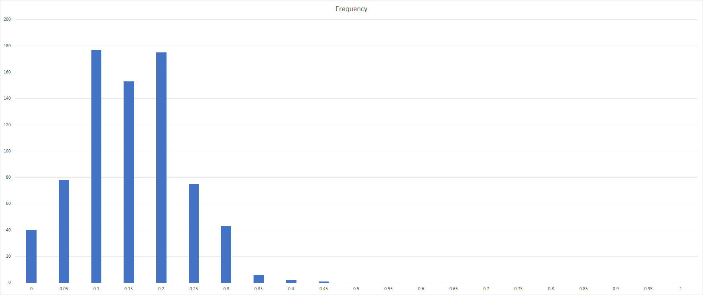

  	- Preference Probability (aka PDF, Blue) vs Percentage Project Distribution (aka percentage of that project distributed to students, Orange)
		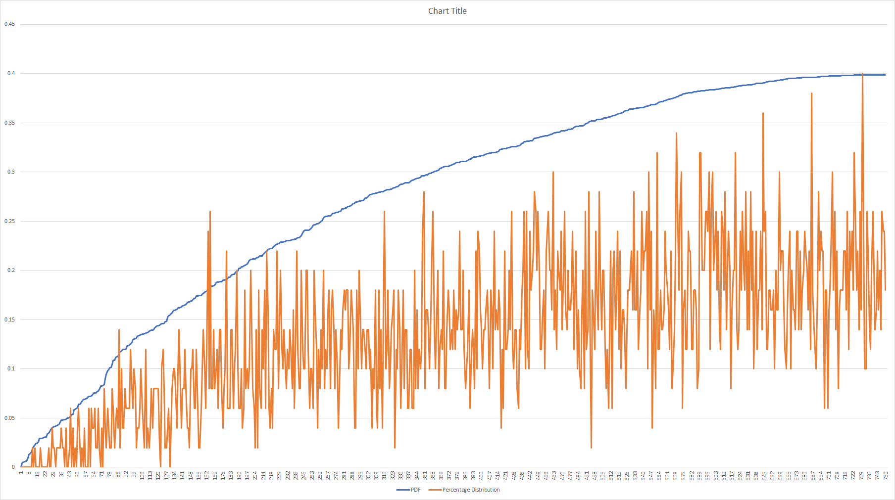 -->
